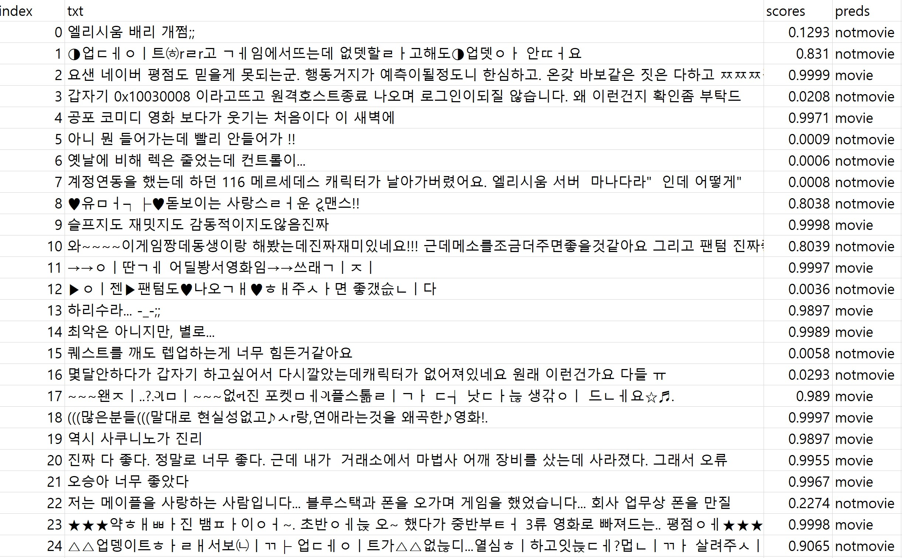
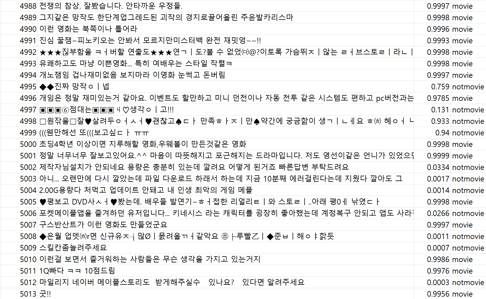
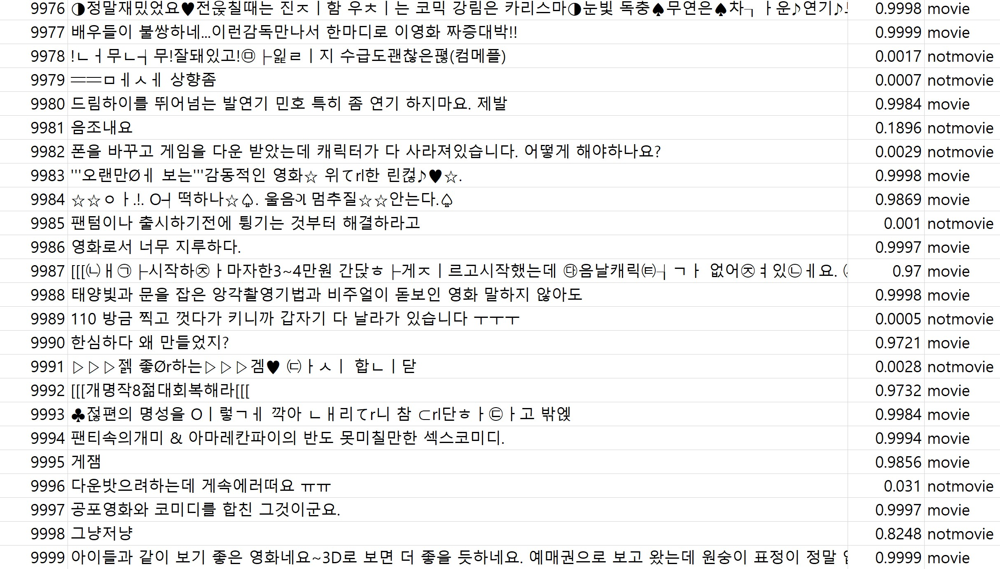

# BaekBERT
이 모델은 KcBERT Large pretrain 모델을 활용한  
DownStream Task 모델입니다.  
영화 관련 글과 비영화 관련 글을 걸러줍니다.  

# Description
KcBERT는 BERT를 기반으로 한국어 댓글에 대해 pretrain 된 모델이라 본 task에 적합하다고 판단했습니다.
PyTorch Lightning으로 작성되어 ddp나 mixed precision과 같은 대용량 훈련 기법을 안정적으로 구동해볼 수 있는
장점도 있어 reference로 활용하기로 했습니다.

나날이 생겨나는 신조어, 새로운 유형의 변칙 단어, 오타를 일일히 cleansing하기는 어렵습니다.
기본적인 cleansing만 진행하고도 강건함을 보일 수 있는 모델이 있으면 어떨까 하는 생각에
미리 comment로 훈련된 모델을 불러오고, 그 모델을 영화 여부에 맞게 분류하는 down stream하는 task를 진행했습니다.

kcbert-base, large 모델은 제가 아는 한에서 nsmc SOTA를 기록한 pretrain 모델이라 골랐습니다.

nsmc셋 + 크롤링 데이터로 down stream한 모델로 생성된 checkpoint로 제시받은 dataset을 분류하고,
특정 score 미만의 confidence를 보이는 데이터만 따로 확인하는 process를 구상해봤습니다.

# Dataset
1. Train/Validset  
Positive : NSMC 데이터셋 (네이버 영화 감성분석 데이터셋)  
Negative : 자체 크롤링한 게임관련 게시글 데이터셋  
  
2. Testset for infer  
Private

# How to use
0.  
pip install -r requirements.txt  

1. finetune  
cd finetune 
python main.py

2. infer   
python infer.py

# infer results
  
  

# Pretrained Models
You can check my model here!
BaekBERT Pretrained Model [Download here](https://drive.google.com/file/d/1J_wdSEY1W6Q_qDRnFYiohGUbyd2qh_ss/view?usp=sharing)  
  
이 모델을 다운 받은 로컬 위치를 infer.py의 finetune_ckpt에 입력하시면  
원하는 데이터셋에 직접 infererence 해보실 수 있습니다.  

# Reference
[KcBERT: Korean comments BERT](https://github.com/Beomi/KcBERT)  
[Transformers by HuggingFace](https://github.com/huggingface/transformers)
